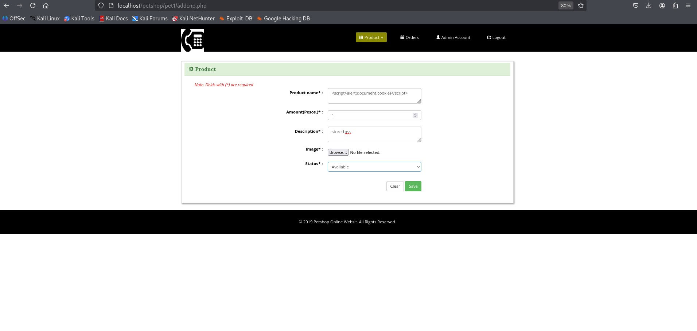
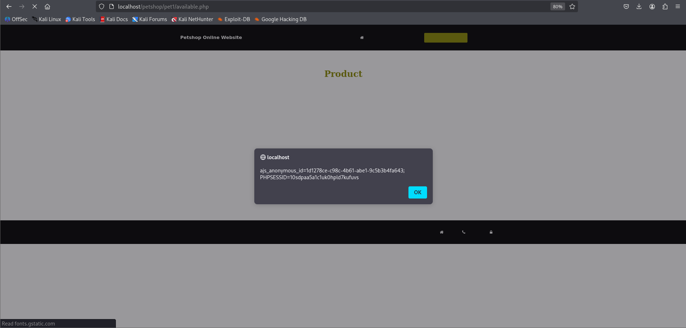
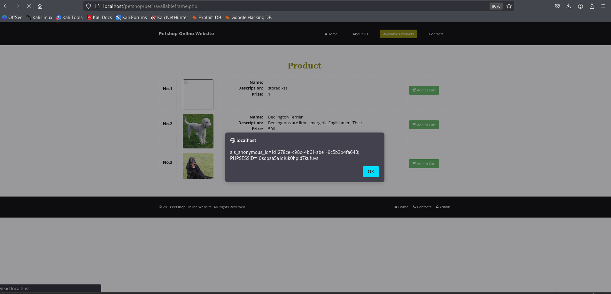

# Online Petshop Management System Stored XSS PoC

|             | Details |
|-------------------|---------|
| **Vulnerability Type** | Stored Cross-Site Scripting (XSS) |
| **Affected File** | `addcn.php (insertion)` |
| **Parameter** | `name` & `description` |
| **Vendor** | [itsourcecode](https://itsourcecode.com/) |
| **Product** | [Online Petshop Management System v1](https://itsourcecode.com/free-projects/php-project/online-petshop-management-system/) |
| **Softlink** | https://itsourcecode.com/free-projects/php-project/online-petshop-management-system/ |

### Summary

-  The Petshop Online Website is vulnerable to Stored Cross-Site Scripting (XSS) through the `addcnp.php` script. Malicious JavaScript can be injected into the name or description parameters when adding a new product. The payload is stored in the `tblcnp` database and later displayed unsanitized in `availableframe.php`. Since `available.php` embeds `availableframe.php` inside an iframe, the malicious script executes whenever a user visits the Available Products page.

### Vulnerable Code
-  `addcnp.php` (insertion of unsanitized user input)
```php
$name = $_POST['name'];
$description = $_POST['description'];
$prize = $_POST['prize'];

$sql = "INSERT INTO tblcnp (name, description, prize, status) 
        VALUES ('$name', '$description', '$prize', 'available')";
mysqli_query($con, $sql) or die(mysqli_error($con));
```
-  Root Cause: User input `(name, description)` is directly inserted into the database without sanitization.
-  Later, when displayed in `availableframe.php`, the stored payload is echoed into HTML without escaping, enabling script execution.

---

## Proof of Concept

1.  Injection via `addcnp.php`. Submit the following payload in the Name or Description field:
```javascript
<script>alert(document.cookie)</script>
```


2.  Stored in Database. The payload is inserted into the `tblcnp` table.

3.  Reflected in `availableframe.php` and `available.php`.





Execution in available.php

Visiting available.php (which embeds availableframe.php inside an iframe) executes the malicious JavaScript.
